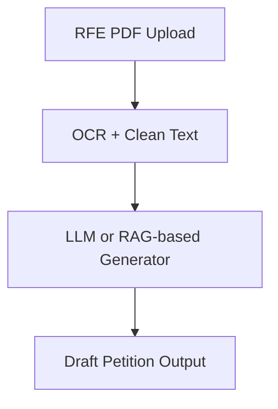

# 🧭 ImmigrationAI Step-by-Step Roadmap

---

## 🔹 PHASE 1: Data Collection & Annotation

### ✅ Step 1. Collect RFE and Petition Examples

Gather as many RFE PDFs and corresponding petition letters as possible.

**Example sources:**

- USCIS AAO decision PDFs  
- Publicly available attorney petition templates  
- Sample RFEs from law blogs or forums  

---

### ✅ Step 2. OCR the PDFs

Use tools like **Tesseract**, **Google Document AI**, or **PDFPlumber** to extract clean text.

Save text in this format:

<pre>

{
  "rfe_text": "Text extracted from RFE...",
  "petition_text": "Petition that successfully responded..."
}

</pre>

📁 Store everything in **JSON** or **CSV** format.

---

## 🔹 PHASE 2: Legal Framework Integration

### ✅ Step 3. Collect Legal Texts

Download or scrape legal documents from sources like:

- USCIS Policy Manual  
- 8 CFR Parts 204 & 205  
- INA  
- AAO Decisions  
- *Matter of Dhanasar*, *Matter of Price*, *Kazarian v. USCIS*  

---

### ✅ Step 4. Preprocess & Structure Legal Texts

- Parse text into sections or paragraphs.  
- Store in a retrieval-friendly format (e.g., JSON or Markdown).

Example structure:

<pre>

{
  "source": "USCIS Policy Manual",
  "section": "Volume 6, Part F, Chapter 5",
  "text": "To qualify under EB-1B..."
}

</pre>

---

## 🔹 PHASE 3: Model Preparation & Training

### ✅ Step 5. Decide on Training Architecture

You have two options:

#### 🔁 Option A: Fine-Tune a Large Language Model

- **Input**: `"rfe_text"`  
- **Output**: `"petition_text"`  
- **Tools**: Hugging Face Transformers, Google Vertex AI  

#### 📚 Option B: Use RAG (Retrieval-Augmented Generation)

- Store legal documents in a vector DB (e.g., **FAISS**, **Pinecone**, **ChromaDB**)  
- Use LLM + retriever to:  
  - Read the RFE  
  - Retrieve relevant legal rules  
  - Generate grounded petition content  

> RAG is easier to update when laws change.

---

## 🔹 PHASE 4: Training / Inference Code Setup

### ✅ Step 6. Tokenize and Format Your Dataset

- Clean and truncate text to 512–1024 tokens  
- Format as:

<pre>

{
  "input": "RFE: ...",
  "output": "Petition: ..."
}

</pre>

---

### ✅ Step 7. Fine-Tune a Model

- Use **FLAN-T5**, **Mistral**, or **Gemini** via Vertex AI  
- Use `transformers.Trainer` API or Vertex's fine-tune feature  
- Train on your RFE→petition pairs  
- Optionally use legal text snippets as system prompt/context  

---

## 🔹 PHASE 5: System Pipeline & Integration

### ✅ Step 8. Build the Pipeline

----

**Optional**: Add an NER/classifier model to detect:

- Visa category  
- Missing documents  
- Case type  

---

### ✅ Step 9. Add Legal Grounding (Optional but Strongly Advised)

Inject legal citations into the output by retrieving relevant legal chunks.

**Sample prompt to LLM:**

<pre>
RFE: [text]  
Relevant law: [retrieved USCIS policy paragraph]  
Generate a petition letter based on both.

</pre>

### ✅ Step 10. Evaluate Output Quality

Have immigration lawyers or legal experts review for:

- Completeness  
- Legal accuracy  
- Tone and formality  

Include automated metrics:

- BLEU  
- ROUGE  
- Compliance checklists  

---

### ✅ Step 11. Deploy on Vertex AI

- Upload the model and legal documents  
- Expose an API that takes RFE PDFs and returns petition drafts  
- Build a UI to upload PDFs and edit petition outputs  

---

## 🔹 PHASE 7: Updates and Maintenance

### ✅ Step 12. Keep Legal Frameworks Fresh

Write scripts that:

- Monitor for new AAO decisions  
- Pull updated USCIS policy text  
- Re-index your RAG vector database or retrain your model as needed

